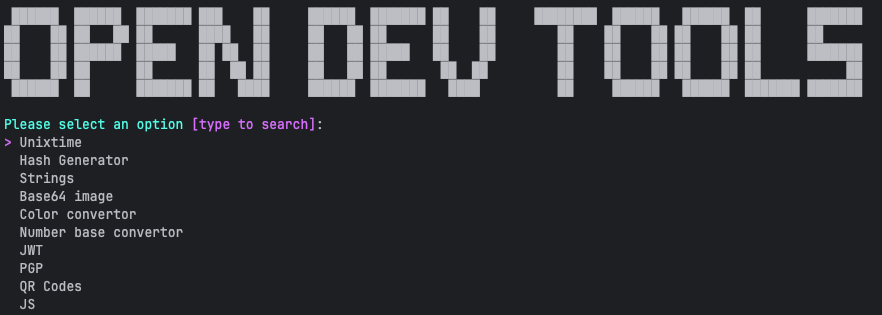

# OPEN DEV TOOLS

Open source offline console realization for most popular tools for developers.

## ADVANTAGES 

- Free.
- Open source.
- Full offline.
- Manu input and output option
- Cross-platform(linux, mac, windows).
- Ready to use binaries.

## TOOLS

- [x] Create MD5, SHA-1, SHA-256, SHA-384, SHA-512 from string/file.
- [x] Encode/decode to unix time.
- [x] Base64 decode/encode string
- [x] Base64 decode/encode image
- [x] HEX to RGB/RGBA color
- [x] Lorem Ipsum Generator
- [x] JWT Read
- [x] JS Beautify
- [x] JS Minify
- [x] Encode/decode unicode string
- [x] QR Code Reader/Generator
- [x] Number Base Converter
- [ ] URL Encode/Decode
- [ ] YAML to JSON
- [ ] JSON to YAML
- [ ] HTML Beautify/Minify
- [ ] CSS Beautify/Minify
- [ ] JSON Format/Validate
- [ ] JSON to CSV
- [ ] CSV to JSON
- [ ] String Case Converter
- [ ] Certificate Decoder (X.509)
- [ ] Hex to ASCII
- [ ] ASCII to Hex

## SCREENSHOTS

